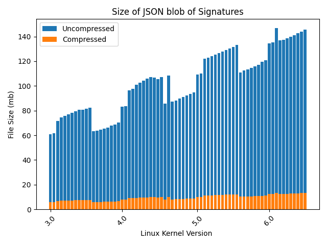

# Hancock 


A tool for finding and collating all of the function signatures in a git repository, particularly for the linux kernel.


## Usage

```bash
git clone https://github.com/zackmaril/hancock.git
cd hancock
git clone https://github.com/torvalds/linux.git artifacts/linux
poetry install
poetry run python hancock/main.py --repo artifacts/linux --output blobs/linux_functions
gzip blobs/linux_functions.json
# should be about 5.7mb gzip, 80mb unzipped.
```

## Motivation

[bpfquery.com](https://bpfquery.com) takes in sql, compiles it to bpftrace code and then runs and visualizes the results in real time. bpftrace lets you hook into the kprobes, which correspond to various linux kernel routines. While linux will tell you what kprobes are available on a specific instance, it doesn't tell you what the function arguments are nor the return type. This has meant that one has to do a bunch of CAST's when writing bpftrace programs in order to work with the pointers to various types, and it also makes it difficult to do typeahead completion with editors. So, I wrote this tool to crawl the linux kernel source and extract the function signatures from the code. 

# Design 

In flux. Right now it can dump out all the function signatures for a particular tagged release of the linux kernel into json. Next up, I want to be able to produce  a json blob for all tagged releases and produce a unified index. The goal of bpfquery is to let you do adhoc queries on any linux kernel release, so I want to have a single json blob that contains all the function signatures for all releases and see how big that gets.

# Notes

Below is a chart of the size of the json blob for each linux kernel release as produced by the `hancock/main.py` script.



Easy to see that it gets bigger and bigger over time as the linux kernel grows. 

* Total size of all the json blobs: 7,425 mb
* Total size of all the json blobs compressed: 688 mb
* Compression ratio: 9.2%

688 mb is still pretty large, but it's only 9.2% of the original uncompressed size. If we compress all of the files together, then we get at most a reduction by 674 mb. So, all told, we're looking at a reduction of about 90% from the original 7,425 mb.

Less than a GB isn't bad, and v3 of the kernel really is not used all that often anymore, so there is a fair amount of stuff to cut out at some point. If we are just going for kprobes, then we can cut even more I imagine, but it's difficult to know what is and isn't a kprobe ahead of time in fact. 

## License

MIT

